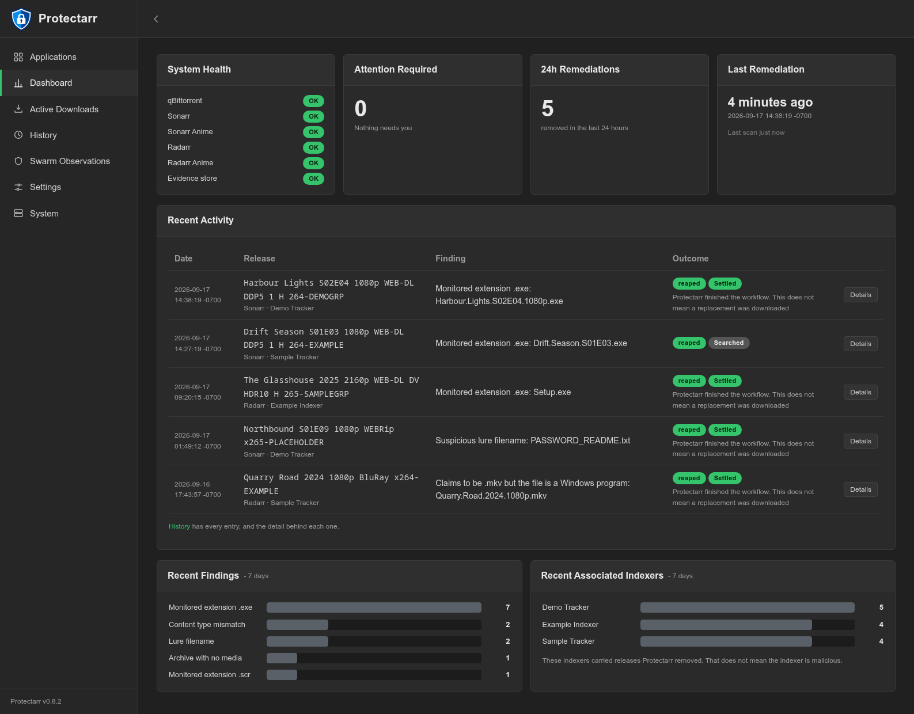
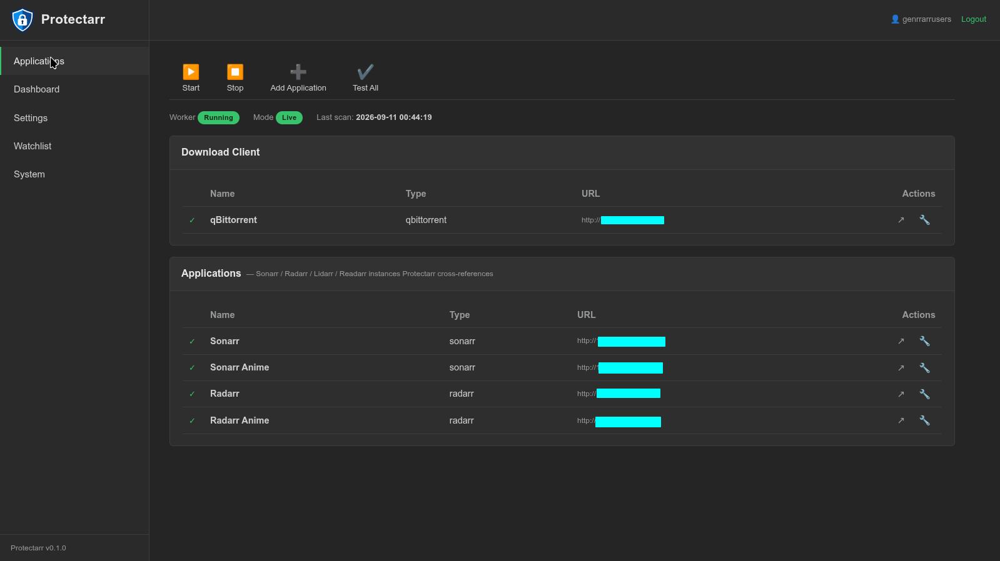
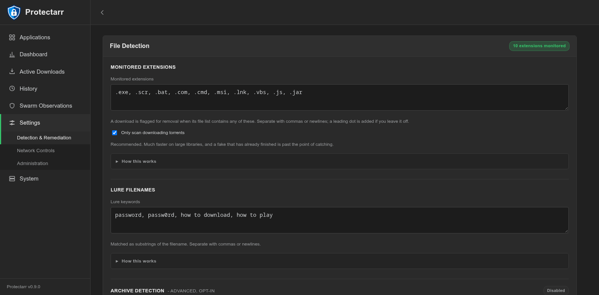

<p align="center">
  
</p>

<p align="center"><b>Kill fake <code>.exe</code> torrents before they finish - and keep your *arr stack self-healing.</b></p>

<p align="center">
  
</p>

---

Public torrent trackers seed fake "releases" whose file list is a video-sized
executable, e.g.:

```
Ted.Lasso.S04E07.1080p.ATVP.WEB-DL.DDP5.1.H.264-NTb.exe   1.06 GB
```

qBittorrent learns a torrent's **file list from its metadata within seconds of
adding it - before the content downloads.** Protectarr watches that list and, on
a hit, hands the release back to the owning *arr's queue API with
`blocklist=true`, so the *arr removes it and blocklists it. Protectarr then
decides whether to requeue based on the air/release date (see below).

Handing it back to the *arr - instead of just deleting it in qBittorrent - is
the whole trick: deleting it directly leaves the *arr's queue stuck and it never
searches again.

## What it looks like

The dashboard: what's connected, what's been caught, and which indexers the
fakes are coming from.

<p align="center">
  
</p>

Applications: qBittorrent and each *arr, with a Test button per connection.

<p align="center">
  
</p>

Monitored Extensions: the extensions that flag a download, plus the lure-filename
and archive rules.

<p align="center">
  
</p>

## What happens when a fake is caught

On a hit, Protectarr calls the owning *arr's queue API to remove the download
with `removeFromClient=true` and `blocklist=true`. That does three things:

1. **Removes the torrent from qBittorrent** (the client entry and its files).
2. **Blocklists the release in the *arr.** Sonarr, Radarr, Lidarr, Readarr and
   Whisparr each keep their own blocklist; the caught release is added to it, so
   the *arr will not grab that same release again on the next RSS/search pass.
3. **Skips the *arr's own auto-redownload** (`skipRedownload=true`) - Protectarr
   decides whether to requeue itself, based on the air/release date (see
   [Requeue behaviour](#requeue-behaviour-air-date-aware)).

The blocklist entry is what stops the fake from coming straight back, and because
the *arr performs the removal its queue never ends up stuck.

Every one of those decisions is recorded on the **History** page: the release,
the app that owned it, what triggered the catch, whether the blocklist entry was
confirmed, and whether a replacement was searched for or deliberately held. Dry-run
detections are recorded too and filtered out of the Live view, so testing never
inflates the numbers.

## Why not just use qBittorrent's "Excluded file names" or Sonarr's "Fail Downloads"?

- **qBittorrent excluded files** stop the download but leave the torrent in a
  limbo state the *arr doesn't recognise as failed, so it never grabs a
  replacement.
- **Sonarr/Radarr "Fail Downloads → Executables"** works, but only *after* the
  full file downloads (it inspects at import time). You still pull the whole
  ~1 GB fake.

Protectarr catches it up front *and* keeps the *arr self-healing.

## Run it

### Docker - pull the image (easiest)

A pre-built image is published to the GitHub Container Registry on every push:
`ghcr.io/irnutsmurt/protectarr:latest`.

```bash
mkdir config
cp config.example.yaml config/config.yaml   # then edit it (or configure in the WebUI)

docker run -d --name protectarr \
  -p 8090:8090 \
  -v "$PWD/config:/config" \
  --restart unless-stopped \
  ghcr.io/irnutsmurt/protectarr:latest
```

Or with Compose - the provided `docker-compose.yml` already points at the image:

```bash
docker compose up -d
```

> GHCR packages have their own visibility, separate from the repo. If the package
> is still private, either make it public (your GitHub profile -> Packages ->
> protectarr -> Package settings -> Change visibility -> Public) so anyone can
> pull it, or `docker login ghcr.io` first with a token that has `read:packages`.

### Docker - build from source

```bash
git clone https://github.com/irnutsmurt/protectarr.git
cd protectarr
mkdir config && cp config.example.yaml config/config.yaml
docker compose up -d --build     # uncomment `build: .` in docker-compose.yml
```

Open the WebUI at `http://<host>:8090` to configure connections, test them, and
watch a live dry-run preview.

Two Docker gotchas:

- **Port clash:** if qBittorrent already uses `8090` on the same host, publish
  Protectarr on another port, e.g. `-> "8099:8090"`.
- **Reaching your services:** set `qbittorrent.url` (and the *arr URLs) to
  addresses reachable *from inside the container* - use the host's LAN IP
  (`http://192.168.1.100:8090`), **not** `localhost`, which points at the
  Protectarr container itself.

### Bare Python

Requires Python 3.9+.

```bash
git clone https://github.com/irnutsmurt/protectarr.git
cd protectarr
python -m venv venv
./venv/bin/pip install -r requirements.txt

export PROTECTARR_CONFIG=./config.yaml       # defaults to /config/config.yaml
cp config.example.yaml config.yaml           # edit it (or configure in the WebUI)

./venv/bin/python run.py            # worker + WebUI
./venv/bin/python run.py --no-web   # headless worker only
```

## Configuration

Everything lives in `config.yaml` (editable by hand or through the WebUI).
Secrets can come from env vars instead: `PROTECTARR_QBIT_API_KEY`,
`PROTECTARR_QBIT_PASSWORD`, `PROTECTARR_QBIT_URL`, `PROTECTARR_QBIT_USERNAME`,
`PROTECTARR_WEB_API_KEY`, `PROTECTARR_DRY_RUN`.

### WebUI authentication

Modelled on the *arr apps (Settings → Security):

- **Method:** `none`, `basic` (browser popup), or `forms` (login page). Forms and
  Basic both check a username + hashed password; the **API key bypasses** auth.
- **Authentication required:** `enabled`, or `local_disabled` to skip auth for
  LAN/private clients.

`local_disabled` trusts the client's address. If Protectarr sits behind a
reverse proxy, set `auth.trusted_proxies` to the proxy's CIDR(s) so
`X-Forwarded-For` is honoured only from the proxy - otherwise a client can spoof
that header to look local. If you don't run a trusted proxy, keep it `enabled`.

### qBittorrent auth

qBittorrent **≥ 5.2.0** supports API keys (Web UI → Options → Web UI → generate a
key, `qbt_…`). Set `qbittorrent.api_key` and it's used instead of the
username/password. Older versions fall back to the Web UI username/password.

### Safety modes

| mode          | reaps                                                                 |
|---------------|-----------------------------------------------------------------------|
| `arr_tracked` | only torrents a configured *arr has in its queue (**safest** - your hand-added downloads like Linux ISOs are never touched) |
| `allowlist`   | any torrent whose category/tag is in your allowlist                   |
| `both`        | must be *arr-tracked **and** allowlisted                              |

When a reaped torrent is *arr-tracked, it's failed+blocklisted via that *arr.
In `allowlist` mode a matching torrent that no *arr owns is deleted straight
from qBittorrent.

### Security profiles

A detector reports what it saw; the profile decides how serious that is and what
to do about it. The same observation gets opposite verdicts depending on what the
download is supposed to be:

| observation | Media | Software |
|-------------|-------|----------|
| monitored extension (`setup.exe`) | critical, block | info, allow (it's the release) |
| lure filename (`PASSWORD.txt`) | high, block | high, warn |
| archive with no media | high, block | info, allow |

`media` is the default everywhere and blocks on everything, which is exactly what
Protectarr has always done - existing setups are unchanged. Set a different one
per *arr (a `profile` key on the app entry), per category
(`safety.category_profiles`), or globally with `detection.profile`. Individual
rules can be overridden:

```yaml
detection:
  profile: media
  profiles:
    media:
      lure_filename: {severity: medium, decision: warn}
```

Profiles are orthogonal to the safety modes above: **safety mode decides what
Protectarr may touch, the profile decides how it judges what it touched.** A
`warn` is recorded in History once per torrent and nothing is removed. A reason
no profile knows about warns rather than blocks, so a future detector can never
delete downloads before its policy is deliberately wired up.

### Requeue behaviour (air-date aware)

Reaping removes + blocklists the fake and tells the *arr **not** to
auto-redownload, so Protectarr controls requeueing itself:

- **Aired/released already** → requeue (search for a clean release).
- **Not out yet** → hold. For an episode that hasn't aired, every public-tracker
  "release" is necessarily a fake, so requeueing would just pull the next one.
  The reaper blocklists what it sees and lets the *arr's normal RSS grab the real
  release once it actually drops.

Controlled by `safety.requeue_after_airdate` (default true) and
`safety.airdate_grace_hours` (wait N hours past the air time before requeuing,
since web releases often land a little after the broadcast slot). Air/release
dates come from Sonarr (`airDateUtc`) and Radarr (`digitalRelease` /
`physicalRelease`); types without a meaningful "aired" concept are held.

## Optional: peer IP blocklist

Protectarr can also maintain a peer **IP blocklist** for qBittorrent (default
source: [Naunter/BT_BlockLists](https://github.com/Naunter/BT_BlockLists)). It
downloads the list, writes it to `ip_blocklist.path`, and (if `apply_to_qbit`)
enables qBittorrent's IP filter pointed at that file, refreshing on a schedule.
There's an **Update now** button in the WebUI.

Because qBittorrent loads the filter from its **own** filesystem, `path` must be
readable by qBittorrent - and Protectarr sends **one** path value to both sides,
so that path has to resolve to the same file inside *both* containers.

- **Same host / bare metal (Protectarr and qBittorrent on one machine, no
  Docker):** point `path` at any location both can reach, e.g.
  `/var/lib/protectarr/ipfilter.p2p`. Because there's no container boundary the
  path is literally the same for both, and `qbittorrent.url` can just be
  `http://localhost:8080`. The one requirement is **permissions**: Protectarr
  writes the file, and the qBittorrent process (often a different service user)
  must be able to *read* it - put both users in a shared group, or write it
  world-readable (`chmod 644`), and make sure the containing directory is
  traversable by qBittorrent's user.
- **Docker:** the reliable trick is to keep the blocklist **inside qBittorrent's
  existing `/config` mount**. qBittorrent already sees anything under `/config`,
  so you only mount that subfolder into *Protectarr*, and both agree on one path.

Worked example with a `linuxserver/qbittorrent` container whose config lives at
`/volume1/docker/qbittorrent` (mounted `-> /config`):

1. Make the folder and give it to qBittorrent's user (its `PUID:PGID`, e.g.
   `1028:100`), so Protectarr can write and qBittorrent can read:

   ```bash
   mkdir -p /volume1/docker/qbittorrent/blocklist
   chown 1028:100 /volume1/docker/qbittorrent/blocklist
   ```

2. In **Protectarr's** compose, run as that same user and mount the folder at
   `/config/blocklist`:

   ```yaml
   protectarr:
     user: "1028:100"                 # match qBittorrent's PUID:PGID
     ports:
       - "8099:8090"                  # avoid clashing if qBittorrent is on 8090
     volumes:
       - ./config:/config
       - /volume1/docker/qbittorrent/blocklist:/config/blocklist
   ```

3. Set `ip_blocklist.path: /config/blocklist/ipfilter.p2p`.

qBittorrent reads that file through its own `/config` mount; Protectarr writes it
through the subfolder mount - **same path string, same file.** You do **not**
need to add any blocklist mount to the qBittorrent container itself; the folder
is already under its `/config`. (If qBittorrent uses `network_mode: service:...`
for a VPN, that's fine - the blocklist is a filesystem concern, unaffected by the
network mode.)

The list is P2P format (`label:startIP-endIP`), which qBittorrent's IP filtering
accepts natively.

### Manually banned IPs

For a small, hand-curated set of individual IPs there's a separate
`banned_ips` option that Protectarr pushes to qBittorrent's *manually banned IPs*
via the API - **no file or shared volume needed** (works cleanly across
containers). It can merge with qBittorrent's existing banned list rather than
overwrite it. Use this for one-off bans; use the IP filter above for bulk lists.

## Important: leave qBittorrent's "Excluded file names" empty

Protectarr replaces that feature. If both are active, qBittorrent's exclusion
jams the download into a state Protectarr (and the *arr) can't cleanly fail.

## Performance

With `detection.only_active` on (the default) Protectarr asks qBittorrent for
just the downloading torrents rather than fetching the whole list and discarding
most of it. On a 1214-torrent library that is the difference between 2.4 MB and
2 KB per poll, and a scan that takes 0.04s instead of 5.6s. Turning
`only_active` off restores the full sweep, including finished torrents.

## Logging

Protectarr logs every step: which torrents were inspected or skipped and why,
what each detector saw, how the profile judged it, and the air-date decision
behind a requeue. Level, retention and log downloads live in
**Settings -> Logging**.

- **Timezone:** set it in the UI, or with `TZ=America/Los_Angeles` in
  docker-compose. Without either, a container runs on **UTC**, so its logs read
  hours away from your own clock. Every timestamp carries its UTC offset
  regardless, so a log is never ambiguous about which zone produced it. This
  applies to history and the harvest ledger too, not just logs.
- **Levels:** `debug`, `info`, `warning`, `error`. The file level and the
  console level (what `docker logs` shows) are set separately, so the file can
  be verbose while the console stays readable.
- **Rotation:** the file rolls over at midnight, is renamed with the date and
  gzipped, and is deleted once older than `retention_days` (default 14).
- **Downloads:** each file, or all of them as a `.zip`, straight from the WebUI.

**Credentials are redacted from every log**, both literal values from your
config and anything that merely looks like a key (`?apikey=`, `qbt_…`,
`Authorization: Bearer …`). A log file is therefore safe to attach to a GitHub
issue.

```yaml
timezone: ""            # e.g. America/Los_Angeles; blank = TZ env var, else UTC

logging:
  level: info           # debug | info | warning | error
  console_level: info
  file_enabled: true
  path: ""              # blank = alongside your config
  retention_days: 14
```

## Detection scope

Detection is by **file extension** in the torrent's file list - which is exactly
how these fakes are named. It does **not** catch a payload disguised with a
genuine media extension (an `.mkv` that's actually a PE binary); that needs
content/magic-byte inspection and a partial download.

## HTTP API

Protectarr exposes a small JSON API, authenticated the same way as the *arr apps.
A key is auto-generated on first run and shown in **Settings → Security**; send it
as the `X-Api-Key` header (preferred) or `?apikey=` (convenient, but it can land
in proxy/access logs). With WebUI auth set to `none`, the read endpoints are open
like the UI - enable Basic/Forms auth to require the key. The `command` endpoint
always requires the key (or a valid session + CSRF token).

```
GET  /ping                     # health check, no auth - {"status":"ok",...}
GET  /api/v1                    # index of available endpoints
GET  /api/v1/system/status      # version, running, dryRun, lastScan, lastError
GET  /api/v1/stats              # reaped totals (by app / by indexer), blocklist, banned
GET  /api/v1/watchlist          # harvested seeder-IP ledger (?min_fakes=N)
GET  /api/v1/history            # structured event history (?limit=N&show=all|live|dry)
GET  /api/v1/log?limit=N        # recent activity log lines
GET  /api/v1/logfiles           # log files available to download
GET  /api/v1/preview            # dry-run scan - what would be reaped right now
POST /api/v1/command            # {"name": "start|stop|scan|blocklistUpdate"}
```

Examples:

```bash
curl -H "X-Api-Key: $KEY" http://host:8090/api/v1/system/status
curl -H "X-Api-Key: $KEY" -H "Content-Type: application/json" \
     -d '{"name":"scan"}' http://host:8090/api/v1/command
```

## Requires

- qBittorrent Web UI enabled (Options → Web UI).
- API access to each *arr (URL + API key).

Protectarr requeues by triggering a search itself (only after air/release), so
you do **not** need the *arr's "Redownload Failed" setting for this to work.
